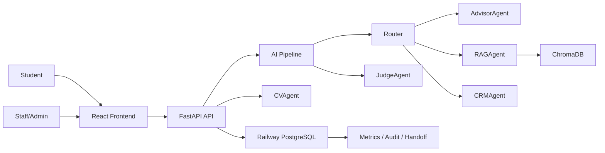

# Pitch Deck - VinUni Admission Assistant

## Slide 1 - One-line Pitch

**VinUni Admission Assistant** là trợ lý AI giúp học sinh chọn ngành VinUni có căn cứ: cá nhân hóa bằng Wizard/CV, trả lời câu hỏi tuyển sinh có nguồn, và chuyển sang tư vấn viên thật khi AI không đủ chắc chắn.

**Live demo**

- Frontend: https://spirited-manifestation-production.up.railway.app/
- Backend: https://a20-app-dung-production.up.railway.app/
- Backend health: https://a20-app-dung-production.up.railway.app/health

---

## Slide 2 - Problem

Học sinh THPT thường gặp 4 vấn đề khi chọn ngành:

- Có quá nhiều ngành và thông tin tuyển sinh, khó biết nên bắt đầu từ đâu.
- Không rõ vì sao một ngành phù hợp hoặc không phù hợp với bản thân.
- CV, điểm số, sở thích, kỹ năng và mục tiêu nghề nghiệp bị rời rạc.
- AI chat thông thường có thể trả lời nhanh nhưng thiếu nguồn, thiếu guardrail, hoặc quá tự tin trong câu hỏi tuyển sinh nhạy cảm.

Với tuyển sinh, một câu trả lời sai hoặc hứa hẹn quá mức có thể ảnh hưởng đến quyết định lớn của học sinh.

---

## Slide 3 - Solution

Sản phẩm xây một workflow tư vấn có kiểm chứng:

1. Học sinh đi qua Wizard 4 bước: sở thích, thế mạnh, điều không thích, phong cách làm việc.
2. Học sinh upload CV/profile để AI hiểu thêm năng lực và mục tiêu.
3. AI gợi ý Top 3 ngành VinUni kèm match score, lý do match, tín hiệu phù hợp và tradeoff.
4. AI Consultant trả lời câu hỏi follow-up bằng RAG từ admissions/FAQ data.
5. Guardrails và JudgeAgent kiểm tra input/output.
6. Nếu câu hỏi cần xác nhận hoặc AI có rủi ro overcommit, hệ thống tạo human handoff cho staff.

---

## Slide 4 - Product Demo Flow

Demo tốt nhất nên đi theo một học sinh cụ thể:

1. Login vào frontend.
2. Upload CV ở Profile.
3. Chạy Wizard chọn ngành.
4. Xem Report Top 3 ngành, match score và match breakdown.
5. Hỏi AI Consultant về ngành, deadline, học phí, học bổng hoặc yêu cầu hồ sơ.
6. Xem nguồn RAG trong câu trả lời.
7. Hỏi câu rủi ro như guarantee admission/scholarship.
8. Demo fallback/handoff sang staff.
9. Staff nhận case trong `/staff`.
10. Admin xem metrics, token usage, audit logs và system health.

---

## Slide 5 - Technology

**Frontend**

- React + Vite
- Route-based student/staff/admin experience
- Wizard, Report, Consultant, Profile, Resources, Staff, Admin, System pages

**Backend**

- FastAPI + SQLAlchemy
- PostgreSQL on Railway
- ChromaDB for vector retrieval
- Multi-agent pipeline: Router, Advisor, RAG, CRM, CV, Judge

**AI/Safety**

- RAG for grounded admissions answers
- CVAgent for profile extraction and CV signals
- InputGuard, OutputGuard, RateLimiter, JudgeAgent, EscalationDetector
- AuditLog for traceability, PMF metrics, fallback rate, token usage

---

## Slide 6 - Architecture

Chi tiết hơn nằm ở `Diagrams_showcase.md`.

---

## Slide 7 - Results

Kết quả hiện tại:

- Live frontend/backend đã deploy trên Railway.
- Có database PostgreSQL production trên Railway.
- Có Wizard -> Report -> AI Consultant -> Human Handoff flow.
- Có CV upload, structured profile extraction, CV signals, review-before-merge.
- Có RAG answers với source labels.
- Có staff/admin operations: handoff queue, metrics, audit logs, token usage, prompt/RAG controls.
- Có evidence package: README, diagrams, journal, worklog, AI logs, evaluation evidence.

---

## Slide 8 - Evaluation Evidence

Evidence đã chuẩn bị:

- `evaluation_evidence.md`: tổng hợp test, metrics, golden eval và live deployment evidence.
- `eval_results_report.json`: 4 golden-eval cases, average score 20.0, pass 0/4.
- `app/ESCALATION_WORKFLOW.md`: escalation workflow và testing notes.
- Backend test files cho guardrails, judge escalation, PMF/handoff, profile/chat impact, session APIs và PII masking.
- `AI-LOG_Manual/sessions.jsonl`: 62 dòng AI log hợp lệ, mapping student đã chỉnh.

Điểm trung thực: golden eval đang chỉ ra hệ thống có lúc guardrail quá chặt và từ chối câu hỏi đáng ra có thể trả lời bằng RAG. Đây là backlog chất lượng quan trọng sau submission.

---

## Slide 9 - Why This Is Different

Sản phẩm không chỉ là chatbot:

- Có Wizard để thu thập tín hiệu có cấu trúc.
- Có CV/Profile để cá nhân hóa.
- Có RAG để trả lời bằng nguồn.
- Có Judge và guardrails để giảm rủi ro sai/hứa quá mức.
- Có human handoff để AI biết dừng lại.
- Có admin metrics để cải tiến dựa trên số liệu.

Thông điệp chính: **AI hỗ trợ tư vấn tuyển sinh, nhưng không thay thế quyết định chính thức hoặc tư vấn viên thật.**

---

## Slide 10 - Next Steps

Sau submission, nhóm sẽ ưu tiên:

- Sửa golden eval bằng cách giảm false safety refusal và tăng coverage của admissions/RAG corpus.
- Kiểm thử lại end-to-end với nhiều CV thật, PDF scan và profile thiếu dữ liệu.
- Cải thiện token/cost dashboard theo route và user.
- Thêm video demo 3-5 phút nếu form yêu cầu link ngoài repo.
- Tối ưu frontend bundle nếu warning chunk-size ảnh hưởng performance.
